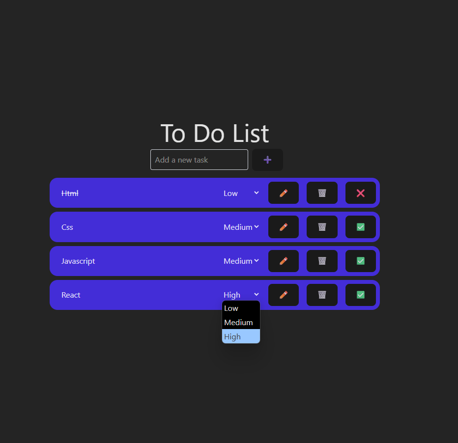

# Η Εφαρμογή μου To-Do

 Μια απλή εφαρμογή λίστας υποχρεώσεων (To-Do) που επιτρέπει στους χρήστες να προσθέτουν, να διαγράφουν, να ορίζουν προτεραιότητες, να επεξεργάζονται και να επισημαίνουν ως ολοκληρωμένες τις εργασίες τους. Η εφαρμογή αποθηκεύει τις εργασίες στον τοπικό χώρο αποθήκευσης του προγράμματος περιήγησης (localStorage), ώστε να παραμένουν διαθέσιμες ακόμα και μετά την ανανέωση της σελίδας.

 ## Χαρακτηριστικά

 *   Προσθήκη νέας εργασίας
 *   Διαγραφή εργασίας
 *   Επεξεργασία υπάρχουσας εργασίας
 *   Επεξεργασία προτεραιότητας εργασίας
 *   Εναλλαγή κατάστασης ολοκλήρωσης (ολοκληρωμένη/μη ολοκληρωμένη)
 *   Αποθήκευση εργασιών στο localStorage για διατήρηση δεδομένων

 ## Τεχνολογίες που χρησιμοποιήθηκαν

 *   React
 *   JavaScript
 *   HTML
 *   CSS (με χρήση Tailwind CSS για τα στυλ)
 *   localStorage API

 ## Μελλοντικές Βελτιώσεις

 *   Προσθήκη περιγραφών για κάθε λειτουργία.
 *   Προσθήκη υπογεργασιών.
 *   Φιλτράρισμα και ταξινόμηση εργασιών.   
 *   Βελτίωση του UI/UX.

## Στιγμιότυπο Οθόνης

 ------------------------------------------------------------------------------------

# My To-Do App

 A simple To-Do list application that allows users to add, delete, edit priorities, edit, and mark their tasks as completed. The application stores tasks in the browser's local storage (localStorage), so they remain available even after refreshing the page.

 ## Features

 *   Add a new task
 *   Delete a task
 *   Edit an existing task
 *   Edit the priority of a task
 *   Toggle completion status (completed/incomplete)
 *   Save tasks to localStorage for data persistence

 ## Technologies Used

 *   React
 *   JavaScript
 *   HTML
 *   CSS (using Tailwind CSS for styling)
 *   localStorage API

 ## Future Improvements

 *   Add descriptions for each task.
 *   Add subtasks.
 *   Filtering and sorting tasks.
 *   Improving UI/UX.

 ## Screenshots
 